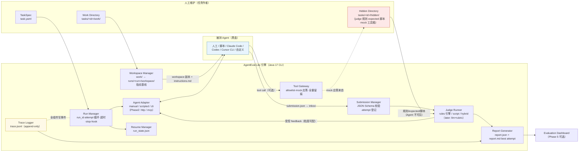
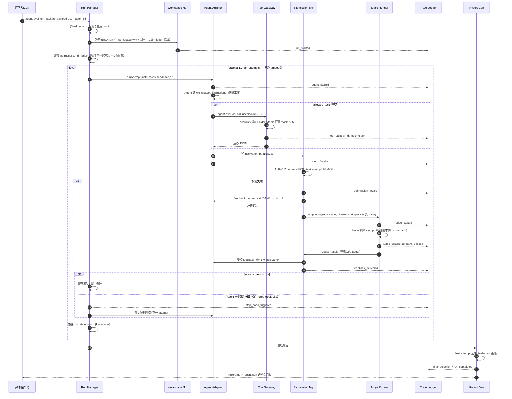

# AgentEval-Lite 设计方案

> 版本：v0.1（设计基线）　日期：2026-07-06
> 定位：通用 AI Agent 评估框架——评估不同 Agent 能否完成指定任务，全程留痕、隐藏验收、生成可复现评分报告。
> 原则：先轻量可跑，再逐步增强；不为了像 EdgeBench 而过度工程化。

## 0. 放置位置决策

**独立项目 `agent-eval-lite`（独立 git 仓库、独立 Maven 工程），不嵌入具体业务 Agent 仓库。**

理由（详见 `01-代码库理解报告.md` §5）：
1. 业务 Agent 与评估框架的生命周期、发布节奏和依赖边界不同；
2. 评估框架对业务应用而言通常是「无运行时消费方」的旁路工具，不应挤进业务架构门禁；
3. 评估框架的被测对象是任意 Agent（CLI / HTTP / 人工），不绑定某个应用；
4. 裁判与选手不同仓，是 Work/Judge 隔离思想在仓库粒度的自然延伸——业务 Agent 可作为**被测 API Agent** 接入本框架。

技术栈：**Java 17 + Maven**（与现有工具链一致）；核心依赖仅 4 个——picocli（CLI）、Jackson databind+yaml（序列化）、networknt json-schema-validator（schema 校验）、SLF4J simple（日志）；测试 JUnit 5 + AssertJ。**不引入 Spring、不引入数据库**，所有产物落文件系统。

## 1. 总体架构



### 模块职责

| 模块 | 职责 | Phase |
|---|---|---|
| **TaskSpec**（`task/`） | 解析、校验 `task.yaml`；产出强类型 `TaskSpec` record；渲染 Agent 视角的 `instructions.md` | 1 |
| **Workspace Manager**（`workspace/`） | 把 `work/` 复制为 run 私有 workspace；记录文件级 SHA-256 基线（供 changed_files 核验）；校验 hidden 完整性指纹 | 1 |
| **Agent Runner / Adapter**（`agent/`） | 统一 `AgentAdapter` SPI；Phase 1 提供 `manual`（人工基线）、`scripted`（离线回放，测试/演示用）、`cli`（通用命令行模板，可接 Claude Code / Codex / Cursor CLI）；Phase 2 加 `http`（如 scaffold 的 chat API）| 1/2 |
| **Tool Gateway**（`tool/`） | Agent 侧只暴露 `agent-eval tool call` 一个入口；按 `allowed_tools` fail-closed；mock 应答取自 `hidden/tools/`（Agent 拿到应答但看不到应答库）；每次调用写 trace | 1 最小版 / 3 完整 |
| **Submission Manager**（`submission/`） | 收取 `inbox/attempt_NNN.json`；通用信封 + 分型 schema 双重校验；不合格直接打回（invalid，不进入评分，不消耗... 消耗 attempt 但标 invalid）；登记 attempt | 1 |
| **Judge Runner**（`judge/`） | 读 hidden 规则/expected/trace/submission/workspace 只读副本；确定性 checks 引擎 + 外部脚本 judge；输出结构化 `JudgeResult`（含规则版本指纹）；拆分「回传 Agent 的受控 feedback」与「完整私有结果」 | 1 |
| **Trace Logger**（`trace/`） | append-only JSONL；全组件事件（生命周期/工具/提交/评分/错误/恢复）；Agent 不可读 | 1 |
| **Report Generator**（`report/`） | best attempt 选择（策略可配）；`report.json` + `report.md`；Phase 2 加多 run / 多 Agent 对比 | 1/2 |
| **Resume Manager**（`state/`） | `run_state.json` 快照（每 attempt 落盘）；`--resume` 从最后 attempt 继续 | 1 |
| **Model/Agent Adapter 扩展** | 模型凭证经环境变量注入 CLI agent（沿用 EdgeBench 姿态）；框架本身不直接调模型（llm-judge 除外，later） | 2 |
| **Evaluation Dashboard** | 静态 HTML/本地小服务读 runs/ 产物 | 5（可选） |

## 2. 目录结构设计

### 2.1 框架仓库

```text
agent-eval-lite/
  README.md                  # 安装·命令·任务编写指南（人工维护）
  pom.xml
  bin/agent-eval             # 包装脚本：java -jar target/agent-eval-lite-*-cli.jar "$@"
  docs/                      # 01 代码库报告 / 02 调研 / 03 本设计 / 04 升级路线
  src/main/java/com/agenteval/
    cli/                     # picocli：run / judge / report / validate / list / tool
    task/                    # TaskSpec + 加载校验 + instructions 渲染
    workspace/               # WorkspaceManager + 指纹
    agent/                   # AgentAdapter SPI + manual/scripted/cli
    tool/                    # ToolGateway + mock 应答匹配
    submission/              # SubmissionManager + schema 校验
    judge/                   # JudgeRunner + checks 引擎 + script judge
    trace/                   # TraceLogger + 事件模型
    report/                  # ReportGenerator + best attempt 选择
    state/                   # RunStateStore
    util/                    # Jsons / Ids / Hashes / Dirs
  src/main/resources/schemas/    # 框架内置 JSON Schema（submission 信封+4 分型、judge 输出、trace 事件）
  src/test/java/...              # 单元测试（judge 引擎、submission 校验、trace、report、e2e）
  tasks/                         # 示例任务库（5 个，见 §10）
  runs/                          # 运行产物根（.gitignore）
```

### 2.2 单个任务目录（人工维护区）

```text
tasks/<task-id>/
  task.yaml                  # TaskSpec（Agent 可读——其中不含任何答案信息）
  work/                      # ✅ Agent 可见上下文（每次 run 复制成 workspace）
    README.md / input/ / docs/ / fixtures/ / src/ ...
  hidden/                    # ⛔ Agent 永不可读；judge 专用
    judge.rules.yaml         # 确定性规则（含 canary、维度、分值、反馈文案）
    expected/                # expected 数据（json/文本）
    judge.py|judge.sh        # type=script|hybrid 时的外部评分脚本
    tools/                   # mock 工具应答库（tool gateway 读取，Agent 只见应答不见库）
    submission.schema.json   # （可选）任务级提交 schema 覆盖
```

### 2.3 单次运行产物（框架生成区）

```text
runs/<task-id>/<run_id>/
  meta.json                  # run 元数据（agent/model/时间/框架版本/指纹）
  instructions.md            # ✅ 渲染给 Agent 的任务说明 + 提交契约
  workspace/                 # ✅ Agent 的工作副本（可读写）
  inbox/                     # ✅ Agent 写提交：attempt_001.json …
  feedback/                  # ✅ 框架写受控反馈：attempt_001.feedback.json …
  judge/                     # ⛔ 完整评分结果（private_notes 等）：attempt_001.judge.json
  traces/trace.jsonl         # ⛔ 全过程留痕
  report/report.json|.md     # 终局报告（评估者视角）
  run_state.json             # ⛔ resume 快照
```

### 2.4 读写权限矩阵

| 路径 | Agent | 框架 | Judge | 维护者 |
|---|---|---|---|---|
| `task.yaml`、`work/**` | 读 | 读 | 读 | **人工编写** |
| `hidden/**` | **禁** | 读（tool gateway/judge 装载） | 读 | **人工编写** |
| `workspace/**` | 读写 | 生成+基线指纹 | 只读副本 | — |
| `instructions.md`、`feedback/**` | 读 | **生成** | — | — |
| `inbox/**` | **写**（唯一提交通道） | 读 | 读 | — |
| `judge/**`、`traces/**`、`run_state.json` | **禁** | 生成 | judge 写/读 trace | 复盘时读 |
| `report/**` | 禁 | 生成 | — | 读 |

## 3. TaskSpec 设计（最终推荐版）

YAML，`snake_case`，由框架 `TaskSpecLoader` 加载并做启动期校验（缺字段/引用文件不存在/权重和≠100 直接 fail-fast，呼应 scaffold 的 fail-closed 惯例）。

```yaml
schema_version: 1
task_id: api-payload-001            # 与目录名一致（加载器强校验）
task_name: 生成合法的创建订单 payload
task_type: api_payload              # code_fix | api_payload | document | tool_call | review | custom
description: >-
  给评估者看的任务背景（不渲染给 Agent）。

agent_brief: |                      # 渲染进 instructions.md 的任务陈述（Agent 视角，禁止出现答案）
  阅读 work/docs/api.md 与 work/input/request.md，产出符合 API 契约的 JSON payload……

visible_context:                    # instructions.md 中向 Agent 声明的可读清单（work/ 内白名单）
  - work/README.md
  - work/docs/api.md
  - work/input/request.md

allowed_tools: []                   # 空=不经框架工具网关（CLI coding agent 自带工具场景）
# allowed_tools:                    # 需要框架 mock 工具时（扁平 allowlist，未列出的工具名一律拒绝）：
#   - name: user.lookup
#     description: 按 user_id 查询用户档案（渲染进 instructions）

submit:
  format: json
  schema: builtin:api_payload       # builtin:<type> 用框架内置分型 schema；或 hidden/submission.schema.json
  max_attempts: 5
  cooldown_seconds: 0               # 两次提交最小间隔（防 feedback-as-oracle 刷分）

judge:
  type: rules                       # rules | script | hybrid（llm: later，见 §6.6）
  rules_file: hidden/judge.rules.yaml
  # script: hidden/judge.py         # type=script|hybrid 时必填
  feedback:
    level: failed_rules             # summary（只给分）| failed_rules（给失败规则的对外文案）| full
    include_scores: true

scoring:
  max_score: 100
  pass_score: 80
  selection: best_score             # best_score | first_pass | last
  dimensions:                       # 权重和必须=100（加载器校验）
    - name: correctness
      weight: 50
    - name: format
      weight: 20
    - name: evidence
      weight: 15
    - name: explanation
      weight: 15

runtime:
  timeout_minutes: 30               # 整个 run 的墙钟预算
  attempt_timeout_minutes: 10       # 单次 agent 调用预算
  allow_multi_submit: true
  auto_eval_interval_seconds: 0     # 0=关闭；>0 为后台快照采样（Phase 3+）
  resume_enabled: true
```

要点：
- **task.yaml 本身可被 Agent 读到**（instructions 由它渲染），所以规则细节、expected、rubric 一律只放 hidden。
- `submit.schema` 支持 `builtin:` 前缀复用框架内置分型 schema，任务无特殊字段时零成本。
- 治理字段（owner / last_reviewed_at / review_interval，借鉴 scaffold `EvalCase`）标 **later**：任务库规模化后再加。

## 4. Submit Contract 设计

### 4.1 通用信封（所有提交必须满足）

所有提交先过**信封 schema**，再过**分型 schema**。信封必填字段：

| 字段 | 必填 | 说明 |
|---|---|---|
| `schema_version` | ✅ | 固定 `1` |
| `task_id` / `attempt_id` | ✅ | 与 run 上下文强校验（不匹配→invalid） |
| `submission_type` | ✅ | `generic \| code_fix \| api_payload \| document \| tool_call \| review` |
| `summary` | ✅ | 本次提交做了什么（≥10 字符，防空提交） |
| `answer` | 分型定 | 核心结构化结果（各分型重命名见下） |
| `evidence[]` | 可选* | `{type: file\|tool_call\|url, source, quote_or_ref}`；document/review 型必填 |
| `tool_calls_used[]` | 可选* | `{tool_name, call_id, purpose}`；call_id 必须能在 trace 中对上（judge 核验）；tool_call 型必填 |
| `known_risks[]` | ✅（可空数组） | 强制 Agent 思考边界，judge 的 safety 维度消费 |
| `needs_human_review` | ✅ | true → runner 暂停并标记 PENDING_HUMAN |

### 4.2 四类分型（在信封之上追加）

**① 通用任务（generic）**——`answer` 为自由结构对象：

```json
{
  "schema_version": 1,
  "task_id": "example_task_001",
  "attempt_id": "attempt_001",
  "submission_type": "generic",
  "answer": {},
  "summary": "本次提交做了什么",
  "evidence": [{"type": "file", "source": "work/docs/api.md", "quote_or_ref": "相关依据"}],
  "tool_calls_used": [{"tool_name": "api.call", "call_id": "tool_call_001", "purpose": "查询用户信息"}],
  "known_risks": [],
  "needs_human_review": false
}
```

**② 代码修改（code_fix）**——追加必填 `changed_files[]`（path 相对 workspace + change_summary）、`tests_run[]`（command + result: passed|failed|not_run）；judge 会核验 changed_files 相对基线指纹真实发生变化：

```json
{
  "schema_version": 1,
  "task_id": "code-fix-001",
  "attempt_id": "attempt_001",
  "submission_type": "code_fix",
  "changed_files": [{"path": "src/PriceCalculator.java", "change_summary": "修复空列表 NPE"}],
  "tests_run": [{"command": "javac … && java …", "result": "passed"}],
  "summary": "修复了空指针并自验",
  "known_risks": ["未覆盖并发场景"],
  "needs_human_review": false
}
```

**③ API / 工具调用（api_payload / tool_call）**——追加必填 `final_payload`（被评对象）；tool_call 型强制 `tool_calls_used` 非空且 `validation_result` 说明如何用工具返回值：

```json
{
  "schema_version": 1,
  "task_id": "tool-call-001",
  "attempt_id": "attempt_002",
  "submission_type": "tool_call",
  "final_payload": {"user_id": "u_1001", "credit_level": "GOLD"},
  "tool_calls_used": [{"tool_name": "user.lookup", "call_id": "tc_a1b2", "purpose": "查用户等级"}],
  "validation_result": {"source_of_credit_level": "user.lookup 返回字段 level"},
  "summary": "基于工具真实返回生成 payload",
  "known_risks": [],
  "needs_human_review": false
}
```

**④ 文档 / 分析（document / review）**——追加必填 `deliverable {type: markdown|json, content}`、`sources[]`（必须指向 visible_context 内文件，judge 核验）、`confidence (0~1)`：

```json
{
  "schema_version": 1,
  "task_id": "doc-analysis-001",
  "attempt_id": "attempt_001",
  "submission_type": "document",
  "deliverable": {"type": "markdown", "content": "# 分析报告…"},
  "sources": ["work/docs/release-notes.md"],
  "confidence": 0.82,
  "summary": "完成了分析报告",
  "evidence": [{"type": "file", "source": "work/docs/release-notes.md", "quote_or_ref": "§2 兼容性变更"}],
  "known_risks": [],
  "needs_human_review": false
}
```

### 4.3 提交通道（唯一）

Agent 把 JSON 写入 `runs/<…>/inbox/attempt_NNN.json`（instructions.md 中给出绝对路径与序号）。**stdout 的自然语言不作为结果**；manual agent 经 `--submission <file>` 由框架代为放入 inbox。校验失败的提交产生 `attempt_NNN.feedback.json`（列出 schema 错误），计一次 attempt 但标记 `invalid`，不进入评分。

## 5. Hidden Judge 设计

### 5.1 Judge 接口（Java）

```java
/** 裁判统一入口：对一次提交产出结构化评分。实现必须只依赖 JudgeInput，禁止读取 runs 之外的可变状态。 */
public interface Judge {
    JudgeResult judge(JudgeInput input);
}

/** Judge 输入：全部为只读视图。 */
public record JudgeInput(
    TaskSpec taskSpec,
    Path hiddenDir,          // hidden/ 根（规则、expected、脚本）
    JsonNode submission,     // 已过 schema 的提交
    Path submissionFile,
    Path workspaceDir,       // 评审用只读副本（command 型 check 在临时副本上执行）
    Path traceFile,          // trace.jsonl（tool_call 核验用）
    String runId, String attemptId) {}
```

### 5.2 Judge 输出（完整私有版）

```json
{
  "schema_version": 1,
  "task_id": "api-payload-001",
  "run_id": "run_20260706_213000_a3f9",
  "attempt_id": "attempt_001",
  "judge_type": "rules",
  "score": 86.0,
  "max_score": 100,
  "passed": true,
  "dimension_scores": {"correctness": 45.0, "format": 20.0, "evidence": 13.0, "explanation": 8.0},
  "passed_rules": ["SCHEMA_VALID", "AMOUNT_MATCHES_EXPECTED"],
  "failed_rules": [
    {"rule_id": "RISK_001", "message": "未说明潜在边界条件", "severity": "medium",
     "dimension": "explanation", "points_lost": 5.0, "blocking": false}
  ],
  "feedback_to_agent": "格式与金额正确；请补充边界条件说明。",
  "private_notes": "expected 命中 3/3；仅评估人员可见",
  "reproducibility": {
    "engine_version": "agent-eval-lite/0.1.0",
    "judge_rules_fingerprint": "sha256:…(hidden/ 目录树指纹)",
    "submission_fingerprint": "sha256:…",
    "workspace_fingerprint": "sha256:…",
    "judged_at": "2026-07-06T21:31:02Z",
    "deterministic": true
  }
}
```

**回传给 Agent 的是裁剪版 feedback**（`feedback/attempt_NNN.feedback.json`）：只含 `score/passed/dimension_scores`（当 `include_scores=true`）与失败规则的**对外文案**（`feedback.level=failed_rules` 时）；`private_notes`、规则 id 细节、expected 值一律不回传。`level=summary` 时只回分数。

### 5.3 规则评分方式（`hidden/judge.rules.yaml`）

```yaml
schema_version: 1
judge_version: "api-payload-001/rules-v1"     # 人工维护的规则语义版本（进 reproducibility）
canary_token: "AEL-CANARY-7f3d9a"             # 出现在提交/workspace 即判作弊（hidden 泄露探针）
checks:
  - id: PAYLOAD_SCHEMA
    dimension: format
    points: 20
    blocking: true                             # 失败即整体 fail（无论总分）
    type: json_schema
    target: $.final_payload
    schema_file: expected/order.schema.json
    feedback_pass: "payload 通过 API schema 校验"
    feedback_fail: "payload 不符合 API schema，请对照 work/docs/api.md 检查字段"
  - id: AMOUNT_CORRECT
    dimension: correctness
    points: 30
    type: jsonpath_equals
    path: $.final_payload.total_amount
    expected_from: expected/answer.json#/total_amount   # expected 值不回显给 Agent
    tolerance: 0.001
    feedback_fail: "总金额不正确，请重新核对折扣规则"
  - id: EVIDENCE_SOURCES_VALID
    dimension: evidence
    points: 15
    type: evidence_sources_valid              # evidence[].source 必须落在 visible_context 内
  - id: TESTS_PASS
    dimension: correctness
    points: 20
    type: command                             # 在 workspace 临时副本中执行（≈ ephemeral judge 容器）
    cmd: "python3 {hidden}/check.py {workspace}"
    timeout_seconds: 60
    expect_exit_code: 0
```

**Phase 1 内置 check 类型**（全部确定性）：

| 类型 | 断言对象 | 用途 |
|---|---|---|
| `json_schema` | submission 任意节点 | 分型/payload 结构 |
| `jsonpath_equals` / `jsonpath_exists` / `jsonpath_matches` | submission | expected 对比（数值容差）、字段存在、正则 |
| `list_coverage` | submission 列表/文本 | 关键点覆盖率（expected_any_of + min_matches），文档/评审任务主力 |
| `evidence_sources_valid` | evidence/sources | 引用必须指向可见文件 |
| `workspace_file_exists` / `workspace_file_contains` | workspace | 代码任务产物核验 |
| `changed_files_verified` | workspace vs 基线指纹 | 申报的 changed_files 确实变化、未申报的敏感文件未变 |
| `command` | workspace 临时副本 | 跑测试/编译/自定义脚本（exit code + 可选输出正则） |
| `tool_call_required` / `tool_call_forbidden` | trace.jsonl | 工具轨迹断言（借鉴 scaffold RuleEvaluator） |
| `no_canary_leak` | submission + workspace | hidden 泄露/作弊探针 |

计分模型：`dimension_score = weight × (earned_points / possible_points)`，总分为各维度和；任何 `blocking: true` 的 check 失败 → `passed=false`（一票否决，借鉴 scaffold `CompositeEvaluator`）；`passed = (score ≥ pass_score) && 无 blocking 失败`。

### 5.4 Schema 校验方式

networknt json-schema-validator（draft 2020-12）。三处使用：① Submission Manager 的信封+分型校验；② judge 的 `json_schema` check；③ 框架自检（judge 输出、trace 事件均有内置 schema，测试中互验）。

### 5.5 Script Judge（`type: script`）

外部可执行程序（python/bash/任意），契约：

```bash
$JUDGE_SCRIPT  # 环境变量注入：
# AEL_SUBMISSION / AEL_WORKSPACE / AEL_HIDDEN / AEL_TRACE / AEL_TASK_YAML / AEL_ATTEMPT_ID
# stdout 输出 JSON：{"checks":[{"id","dimension","points_earned","points_possible","passed","message","blocking"}], "private_notes": "..."}
```

引擎把 script 输出的 checks 并入同一计分模型（`hybrid` = rules + script 合并）。超时/非零退出/输出不合 schema → 记 `JUDGE_ERROR`，该 attempt 判 invalid 并留痕，不给分。

### 5.6 LLM Judge（later，Phase 2+）

- 仅用于主观维度（表达质量、报告结构），权重建议 ≤30%；
- 必须带 rubric（hidden/rubric.md）+ 固定模型 + temperature 0 + 输出 JSON 强 schema；
- `reproducibility.deterministic=false`，并记录 `judge_model`、`rubric_fingerprint`、原始响应存档 judge/ 目录；
- 凭证走环境变量注入 judge 进程（沿用 EdgeBench `SFORGE_JUDGE_*` 姿态），Agent 侧不可见。

### 5.7 防泄露与可复现

- Agent 侧永不出现 hidden 路径：instructions.md 只描述提交契约；tool gateway 只回应答不回库文件。
- run 前后各算一次 `hidden/` 指纹，不一致 → run 标记 `INTEGRITY_BROKEN`。
- 反馈粒度由任务作者控制（§3 `judge.feedback.level`），expected 值与命中细节永不回传。
- canary 探针 + `no_canary_leak` check 兜底检测越界读取。
- 复现：`agent-eval judge --task … --submission …` 可对任意历史提交离线重评；`reproducibility` 四指纹（规则/提交/workspace/引擎版本）保证「评的是什么、用哪版规则评的」可审计。

## 6. Trace Log 设计

### 6.1 存储

`runs/<task>/<run_id>/traces/trace.jsonl`——每行一个事件，append-only，框架各组件经进程内单例 `TraceLogger` 写入（同步 append + flush，评估场景吞吐低，不需要异步缓冲）。run 级元数据（agent/model/成本汇总）在 `meta.json`，避免每行冗余。

### 6.2 事件信封

```json
{
  "event_id": "evt_000042",
  "run_id": "run_20260706_213000_a3f9",
  "seq": 42,
  "timestamp": "2026-07-06T13:31:02.114Z",
  "type": "tool_call",
  "attempt_id": "attempt_002",
  "payload": { }
}
```

### 6.3 事件类型与 payload

| type | payload 要点 |
|---|---|
| `run_started` | task_id, agent_name, model_name, engine_version, hidden_fingerprint, workspace_fingerprint, timeout |
| `agent_started` / `agent_finished` | attempt_id, adapter, command（脱敏后）, exit_code, duration_ms, output_log 文件引用 |
| `file_read`* | path（*经框架工具网关的读取；CLI agent 自带工具的读取不可见，见 §8 边界声明） |
| `tool_call` | call_id, tool_name, input, output_summary（截断 2KB）, success, mock=true/false, duration_ms |
| `shell_command`* | command, exit_code, duration_ms（*经框架执行的命令；judge 的 command check 也记于此） |
| `submission_received` | attempt_id, file, sha256, size |
| `submission_invalid` | attempt_id, schema_errors[] |
| `judge_started` / `judge_completed` | attempt_id, judge_type, score, passed, blocking_failures, rules_fingerprint, duration_ms |
| `feedback_delivered` | attempt_id, level, file |
| `stop_hook_triggered` | reason=below_pass_score, attempts_left |
| `retry` / `resume` | from_attempt, reason |
| `error` | stage, message, stack_ref |
| `usage_recorded`（可选） | tokens_in/out, cost_usd（CLI agent 能导出时记录，导不出记 unavailable） |
| `run_completed` | status, total_attempts, best_attempt_id, wall_ms |
| `final_selection` | policy, best_attempt_id, best_score |

覆盖需求清单：run_id/task_id/agent/model（meta+run_started）、起止时间、可见文件读取、工具调用、shell、提交、judge 结果、重试、错误、最终选择、成本/token（可选）。

## 7. Report 设计

### 7.1 单 run 报告 `report.json`（机器可读，节选）

```json
{
  "schema_version": 1,
  "kind": "single_run",
  "task": {"task_id": "api-payload-001", "task_type": "api_payload", "pass_score": 80},
  "run": {"run_id": "run_…", "agent_name": "claude-code", "model_name": "claude-opus-4-8",
           "started_at": "…", "finished_at": "…", "wall_ms": 754000, "status": "PASSED",
           "engine_version": "0.1.0", "hidden_fingerprint": "sha256:…", "integrity": "OK"},
  "attempts": [
    {"attempt_id": "attempt_001", "valid": true, "score": 62.0, "passed": false,
     "blocking_failures": 1, "failed_rule_ids": ["AMOUNT_CORRECT"], "duration_ms": 210000},
    {"attempt_id": "attempt_002", "valid": true, "score": 91.0, "passed": true,
     "blocking_failures": 0, "failed_rule_ids": [], "duration_ms": 180000}
  ],
  "best_attempt": {"attempt_id": "attempt_002", "policy": "best_score", "score": 91.0},
  "dimension_breakdown": {"correctness": {"earned": 48.0, "max": 50}, "format": {"earned": 20.0, "max": 20}},
  "failure_stats": {"by_rule": {"AMOUNT_CORRECT": 1}, "by_dimension": {"correctness": 1}, "invalid_submissions": 0},
  "tool_usage": {"total_calls": 3, "by_tool": {"user.lookup": 2}, "failed_calls": 0, "unreferenced_calls": 1},
  "safety": {"canary_leaks": 0, "integrity_broken": false, "needs_human_review": false},
  "score_trajectory": [62.0, 91.0]
}
```

### 7.2 `report.md`（人读，结构）

标题（task/run/agent/结论徽章）→ 结果概览表（最佳分/是否通过/attempt 数/耗时）→ 分数轨迹（逐 attempt 表）→ 维度得分表 → 失败规则明细（含对外文案）→ 工具调用摘要 → 安全项（canary/完整性/人审）→ 复现指纹块。

### 7.3 汇总与对比（Phase 2 实现，schema 现在定）

`kind: comparison`——输入多个 report.json，输出：任务×Agent 分数矩阵、同 Agent 不同版本（以 `meta.agent_version`/`model_name` 为轴）趋势、失败原因 Top-N、平均 attempt 数、安全违规计数。命令：`agent-eval compare runs/**/report.json -o compare.md`。

## 8. Runner 执行流程



## 9. Agent Adapter / Tool Adapter / 安全边界

### 9.1 AgentAdapter（Java SPI）

```java
/** 被测 Agent 的统一适配接口。实现必须无共享可变状态，一次 run 一个实例。 */
public interface AgentAdapter extends AutoCloseable {
    String name();
    /** run 开始前的一次性检查/安装（如 CLI 二进制可用性）。失败应抛出并中止 run（fail-fast）。 */
    void prepare(TaskContext context);
    /** 执行一次 attempt：驱动 Agent 工作并期待其向 inbox 产出提交文件。阻塞直至 Agent 结束或超时。 */
    AttemptOutcome runAttempt(AttemptInput input);
    /** 是否支持原生会话恢复（Phase 2：cli agent 的 --resume）。 */
    default boolean supportsResume() { return false; }
    @Override default void close() {}
}

public record AttemptInput(TaskContext context, String attemptId, int attemptNumber,
                           Path instructionsFile, Path previousFeedback /*nullable*/,
                           Duration timeout) {}
public record AttemptOutcome(Optional<Path> submissionFile, boolean agentDeclaredDone,
                             int exitCode, Path agentLogFile) {}
```

Phase 1 实现：

| adapter | 用途 | 机制 |
|---|---|---|
| `manual` | 人工基线 | `--submission file.json` 单发；或交互提示「把提交放入 inbox 后回车」 |
| `scripted` | 离线演示/e2e 测试（对应 scaffold 的 stub-model 思想） | 从 `--script answers.yaml` 按 attempt 序号回放预置提交 |
| `cli` | Claude Code / Codex / Cursor CLI 等 | 命令模板 + 占位符：`claude -p "$(cat {instructions})" --cwd {workspace} …`；环境变量注入 `AEL_INBOX/AEL_ATTEMPT_ID/AEL_FEEDBACK`；模型凭证经环境透传（EdgeBench 姿态） |

Phase 2：`http`（POST 到被测服务，如 scaffold `/api/v1/chat/stream`，SSE 收尾后由 glue 组装提交）、`mcp`（经 MCP client 调被测 agent 工具）。

### 9.2 Tool Gateway

```java
/** 框架侧工具：Agent 经 `agent-eval tool call` 进入，统一 allowlist + 留痕 + mock/real 切换。 */
public interface ToolHandler {
    String name();                                    // 如 user.lookup
    ToolResult call(JsonNode input, ToolContext ctx); // 实现禁止越权读 hidden 之外的评审资产
}
```

- 权限：`allowed_tools` 二级白名单，未列出 → 拒绝并留 `tool_call(success=false, reason=denied)`。
- mock：`hidden/tools/<name>.responses.yaml` 定义 `match`(输入判等/jsonpath) → `response`；命中即回，未命中回 `error: no_fixture`（也留痕）。
- real（Phase 3）：`http.request` 白名单域名 + 超时 + 响应存档（保证复现）；`database.query` 只读连接；`mcp.call`、`browser.action` 均 later。
- 每次调用生成 `call_id` 返回给 Agent——提交里的 `tool_calls_used[].call_id` 必须与 trace 对得上（`tool_call_required` check 核验「真调了、用了真实返回」）。

### 9.3 安全边界

**阶段一：本地目录隔离（合作式评测）**

| 红线 | 机制 |
|---|---|
| Agent 不访问 hidden | ① 物理分区：hidden 永不复制进 workspace，instructions 不出现其路径；② run 前后 hidden 指纹比对（篡改→INTEGRITY_BROKEN）；③ canary 探针检测偷读；④ 框架工具网关内置 PathGuard（realpath 归一后拒绝 workspace 外读写） |
| 不绕过 Submission Manager | inbox 是唯一提交通道，评分只认经 schema 校验的文件；stdout 不解析 |
| 不调用未授权工具 | tool gateway fail-closed；CLI agent 自带工具无法技术拦截 → **判分侧兜底**（tool_call_required 只认 trace 里的 call_id） |
| shell 限制 | 框架代跑的命令（judge command check）有超时+工作目录锁定在临时副本；CLI agent 的 shell 由其自身沙箱负责（Claude Code/Codex 权限模式），本框架在 instructions 声明禁区并靠指纹+canary 审计 |
| 敏感信息 | work/ 只放合成/脱敏数据（任务编写规范写入 README）；`validate` 命令做启动期检查（可配敏感词模式） |
| 生产 API | 默认全 mock；real 工具需在 task.yaml 显式声明 + `--allow-real-tools` 双重确认 |

> 诚实声明：对「拥有任意 shell 的对抗性 Agent」，默认（非容器）模式的目录隔离是**约定+审计**而非强隔离——这正是 Phase 4 的升级理由，也与 EdgeBench 论文附录 C 的结论一致（隔离必须做在环境层）。**该升级的 Agent 侧隔离已落地为 `--sandbox docker`**（见下「已落地」段）。

**阶段二（Phase 4）：Docker 隔离升级路径**

1. work 容器：workspace 挂载为独立卷，无 hidden、无框架代码；网络默认 none（仅放行 LLM API 出口，借鉴 SForge 的 host 侧 iptables 白名单思想）。
2. judge 容器：临时容器挂 hidden + 提交物只读副本，跑完即毁（ephemeral）。
3. 提交经 host 侧本地 HTTP judge server 中介（把 §5 的 Judge 接口挂上 HTTP 即可，接口不变）。
4. task.yaml 增补 `work.image` / `judge.image` 字段（向后兼容：无该字段则回落本地目录模式）。

> **已落地（`--sandbox docker`）**：第 1 点的「work 容器」已实现——`DockerAgentAdapter` 把 cli Agent 命令包进 `docker run --rm`，容器**只**挂载 `workspace/`(rw)、`inbox/`(rw)、`feedback/`(ro)、`instructions.md`(ro)，`hidden/`/`judge/`/`traces/`/任务目录/宿主家目录一律不入容器，默认 `--network none` 断网（需工具时 `--sandbox-network bridge` 经 `host.docker.internal` 回连宿主常驻网关）。`run`/`suite`/`agents.yaml` 全线支持；镜像与附加 `docker run` 参数经 `--sandbox-image` / `--sandbox-docker-arg` 提供。红队 A（外科式偷看）+ A-sym（symlink 逃逸）+ A-find（全盘 find）在 Docker 就绪时全部 DEFENDED，登记基线归 0。**与本节原设计的差异**：判分仍在宿主进程内跑（第 2/3 点的独立 judge 容器 + HTTP 中介未采用），因为判分不接触 Agent、无需容器化即隔离；因此第 4 点的 `judge.image` 字段未引入，仅 Agent 侧按上述参数配置。

## 10. Auto-eval / Stop Hook / Resume（轻量实现）

| 机制 | Phase 1 实现 | 后续 |
|---|---|---|
| **Auto-eval** | 提交即评（每次 submission 后立即 judge）——已覆盖「每轮有采样点」 | Phase 3：`auto_eval_interval_seconds>0` 时后台线程按间隔快照 workspace → judge（kind=auto，**结果不回注 Agent**，只进 trace/report 轨迹） |
| **Stop Hook** | Runner 判定：Agent 退出（agentDeclaredDone）但 score < pass_score 且 attempts/时间还有余量 → 写 `stop_hook_triggered` 事件，携反馈自动唤起下一 attempt | Phase 2+：cli agent 接原生 stop hook（如 Claude Code hooks）阻止会话内提前退出 |
| **Resume** | 每 attempt 后落 `run_state.json`（status/attempt 计数/最佳分/workspace 指纹）；`agent-eval run --resume <run_id>` 校验指纹后从下一 attempt 继续，trace 追加 `resume` 事件 | Phase 2+：cli agent 原生 resume（`claude --resume <session>`），run_state 记 session id |

## 11. 第一批 5 个示例任务

| # | 任务 | 类型 | work/ | hidden judge | 评分要点 |
|---|---|---|---|---|---|
| 1 | `code-fix-001` 修复 Java 计价器空列表 NPE | code_fix | bug 描述 + `src/PriceCalculator.java` + 复现说明 | `command`（javac+java 跑隐藏断言 Main）+ `changed_files_verified` + schema | correctness 50 / tests 20 / format 15 / explanation 15 |
| 2 | `api-payload-001` 按 API 文档生成创建订单 payload | api_payload | api.md（字段/枚举/折扣规则）+ request.md（客户需求） | `json_schema`(order.schema.json) + `jsonpath_equals`(expected/answer.json，含折扣计算) | correctness 50 / format 20 / evidence 15 / explanation 15 |
| 3 | `doc-analysis-001` 三份发布说明提炼破坏性变更报告 | document | docs/v1.md v2.md v3.md | `list_coverage`（隐藏关键点清单 min_matches）+ `evidence_sources_valid` + 引用行核验 | coverage 45 / accuracy 25 / evidence 20 / format 10 |
| 4 | `tool-call-001` 查用户等级并生成开卡 payload（必须调 mock 工具） | tool_call | 任务说明 + 工具目录（只有名字与入参 schema） | `tool_call_required`(user.lookup ≥1 次) + `jsonpath_equals`(等级值=工具返回) + `no_canary_leak` | correctness 40 / tool_usage 30 / safety 20 / format 10 |
| 5 | `prd-review-001` 评审一份故意留洞的 PRD | review | prd.md（缺字段/矛盾/无验收标准） | `list_coverage`（隐藏风险点 rubric：漏洞命中率）+ 结构 schema + 最低数量下限 | risk_coverage 50 / acceptance_criteria 20 / structure 15 / explanation 15 |

每个任务落地时附带：`task.yaml`、work 文件、`hidden/judge.rules.yaml`（+`expected/`）、`samples/`（一份能通过的示例提交 + 一份不通过的）、e2e 测试用 scripted 回放脚本——保证「示例任务必须能跑通」可被 CI 验证。主观维度（如评审文案质量）Phase 1 一律用确定性 `list_coverage` 近似，LLM rubric 标 **later**。

## 12. 分阶段实施计划

| Phase | 内容 | 交付物 | 状态 |
|---|---|---|---|
| **0 调研** | 代码库理解 + EdgeBench 调研 + 选址 | docs/01、02、本文件 | ✅ 完成 |
| **1 最小可运行** | TaskSpec 加载、workspace、manual/scripted/cli 三适配器、submission 校验、rules+script judge、trace、report(json+md)、resume-lite、stop-hook-lite、tool gateway 最小版、5 示例任务、单元+e2e 测试、README | `agent-eval run/judge/report/validate/list/tool` 全链路；`mvn verify` 全绿 | 待确认后实施 |
| **2 多 Agent 对比** | http adapter（接 scaffold chat API）、cli agent 原生 resume/stop-hook、compare 汇总报告、LLM judge（rubric） | `agent-eval compare`；多模型对比报告 | 计划 |
| **3 工具调用评估** | real 工具（http 白名单/db 只读）、auto-eval 间隔采样、mock server 化（跨进程） | 工具质量分析报告段 | 计划 |
| **4 隔离增强** | Docker work/judge 双容器、网络白名单、HTTP judge server | task.yaml 增 image 字段（向后兼容） | 计划 |
| **5 可视化** | 本地 dashboard 读 runs/（任务列表/run 详情/trace/report） | 静态站或本地小服务 | 可选 |

**Phase 1 目标命令**：

```bash
bin/agent-eval validate --task tasks/api-payload-001
bin/agent-eval run --task tasks/api-payload-001 --agent manual --submission my.json
bin/agent-eval run --task tasks/code-fix-001 --agent scripted --script tasks/code-fix-001/samples/replay.yaml
bin/agent-eval run --task tasks/api-payload-001 --agent cli \
  --cmd 'claude -p @{instructions} --permission-mode acceptEdits' --model claude-opus-4-8
bin/agent-eval judge --task tasks/api-payload-001 --submission runs/…/inbox/attempt_001.json
bin/agent-eval report --run runs/api-payload-001/run_20260706_213000_a3f9
bin/agent-eval run --task tasks/code-fix-001 --agent cli --resume run_20260706_213000_a3f9
```

## 13. 与二十条原则的对照（自检）

自然语言不作数（inbox JSON 唯一通道）✓；结构化提交（信封+分型双 schema）✓；work/hidden 物理分区+指纹+canary ✓；Judge 独立（只依赖 JudgeInput，可离线重评）✓；可复现（四指纹+确定性优先+LLM judge 强约束 later）✓；留痕（JSONL 全事件）✓；工具留痕（call_id 闭环核验）✓；多轮可比较（score_trajectory+selection）✓；先轻量（无 Docker/K8s/HTTP server/数据库）✓；基于当前代码库实际（Java/Maven/Jackson/JUnit 对齐，缺失设施均给最小方案）✓；不值得现在做的已标 later（LLM judge、auto-eval interval、治理字段、Docker、dashboard）✓。

## 14. Phase 1 实现偏差记录（设计 → 代码）

实现与本设计文档的少量偏差，均为简化且不改变语义：

1. **`allowed_tools` 扁平化**：从「`tool.call` + 二级 tools 列表」简化为扁平的 `[{name, description}]` allowlist——Phase 1 只有 mock 工具一种通道，二级结构没有信息量；`description` 会渲染进 instructions。
2. **`scripted` 适配器强化为回放模拟器**：replay.yaml 支持 `apply_files`（模拟 Agent 改工作区）、`tool_calls`（经真实网关调用、产生 trace）与提交模板占位符 `{attempt_id}` / `{tool_call_N}`（回放提交能通过 call_id 真伪核验）。这使 5 个示例任务的 fail→pass 闭环可作为无模型依赖的 CI 回归。
3. **trace `seq` 跨进程语义**：工具网关子进程续写 trace 时以「已有行数」为序号起点；极端并发下 seq 可能重复，事件排序以 timestamp 为准（Phase 4 Judge 常驻服务化后由单点收敛）。
4. **`meta.json` 含 task_dir 绝对路径**：run 目录自包含（工具网关子进程、离线重建报告、resume 都只凭 run 目录还原上下文）的代价是 Agent 理论上可从 meta.json 看到任务库路径。本地模式下 Agent 本就有全盘文件系统权限，隔离靠约定+审计（指纹+canary），与 §9.3 的声明一致；Docker 化后 meta.json 不挂载进 work 容器。
5. **报告的 canary 统计约定**：`safety.canary_leaks` 按「失败规则 id 含 `canary`（不区分大小写）」统计，任务作者命名泄露探针检查时应遵循该约定（如 `NO_CANARY_LEAK`）。
